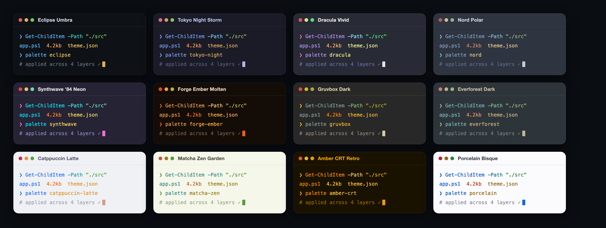

# Posh Palette

<p align="center">
  
</p>

[](https://www.powershellgallery.com/packages/PoshPalette)
[](https://www.powershellgallery.com/packages/PoshPalette)
[](LICENSE)
[](https://github.com/livlign/posh-palette/actions/workflows/tests.yml)

An interactive theme picker for **PowerShell + Windows Terminal**. Browse a
gallery of looks, preview them live, and apply one across all **4 layers** at
once, without leaving your terminal.

<p align="center">
  <a href="https://livlign.github.io/posh-palette/themes.html"></a>
</p>

> **48 themes** from dark dev classics to neon and retro CRT — [browse the full gallery →](https://livlign.github.io/posh-palette/themes.html)

> **Platform:** the Windows Terminal layer (scheme, background, opacity, font) is
> Windows-only. The PSReadLine, `$PSStyle`, and oh-my-posh layers run in any
> PowerShell 7 session, so on macOS/Linux you still get everything except the
> Windows Terminal–specific bits.

| Layer | What it colors | How it applies |
|-------|----------------|----------------|
| Windows Terminal | scheme, background, opacity, font | `settings.json` (hot-reloads instantly) |
| PSReadLine | the command line you type | `$PROFILE` + live session |
| `$PSStyle` | command output (dirs, errors, tables) | `$PROFILE` + live session |
| oh-my-posh | the prompt | `$PROFILE` + live session |

## Install

**Prerequisite:** PowerShell 7.2+ — the modern, cross-platform `pwsh`, not the
built-in Windows PowerShell 5.1 (check with `$PSVersionTable.PSVersion`). Don't
have it yet? `winget install Microsoft.PowerShell`, then start `pwsh`.

```powershell
Install-Module PoshPalette -Scope CurrentUser
palette
```

In Windows Terminal, set the default profile to **PowerShell** (7.x) rather than
**Windows PowerShell** so new tabs use it automatically.

> **oh-my-posh is optional.** Only the prompt layer uses it — the other three
> layers apply without it. The first time you pick a theme whose prompt needs it,
> PoshPalette offers to install it for you (per-user via `winget`, no admin), then
> you re-open pwsh to see the prompt. To install it yourself ahead of time:
> `winget install JanDeDobbeleer.OhMyPosh -s winget`.

## Update

To move to a newer release of the module:

```powershell
Update-Module PoshPalette     # then open a new PowerShell tab to load it
```

You don't have to remember to check: on launch Posh Palette compares your version
against the Gallery (on the same once-a-day cadence it uses to fetch new themes),
and when a newer one is out the menu shows a **`[5] Update`** option — pick it to
run the update right there. New *themes*, separately, arrive on their own with no
module update needed (see **Use → New themes show up automatically**, below).

## Use

Launch the interactive picker, apply a theme by name, or tweak one layer at a
time. The rest — importing schemes, the auto-update catalog, the setup doctor,
and font installs — is grouped below.

### Apply a theme

**Interactive (Simple or Detail mode):**
```powershell
Start-PoshPalette     # or just: palette
```
- **Simple mode:** scroll a list of full themes, live preview on the right, Enter to apply.
- **Detail mode:** choose each layer independently (scheme / prompt / input / output).

**By name:**
```powershell
Install-PoshPaletteTheme tokyo-night
Install-PoshPaletteTheme catppuccin-mocha -DryRun   # preview without writing
```

### Tweak one layer

Change a single part by its catalog name and keep everything else exactly as it is.
Each command edits just that slot on top of your current look:

```powershell
Set-PoshPaletteScheme  nord           # color scheme (Windows Terminal bg + 16 ANSI)
Set-PoshPaletteColors  tokyo-night    # input + output colors (PSReadLine / $PSStyle)
Set-PoshPalettePrompt  auto-twoline   # the oh-my-posh prompt (any oh-my-posh name works too)
Set-PoshPaletteFont    robotomono      # the terminal font
Set-PoshPaletteLayer -Opacity 90 -Acrylic $true -FontSize 12   # window + size
```

A name is the `id` of any entry in `schemes/`, `palettes/`, `prompts/`, or
`fonts.json`. Browse the options in Detail mode, in the
[theme gallery](https://livlign.github.io/posh-palette/themes.html), or by listing
those folders. Your current look is remembered in `~/.poshpalette/current.json`, so
tweaks stack: install a theme, then swap just its prompt, then just its font.

Every command takes `-DryRun` to preview without writing.

### Reset & revert

**Reset to default** (stock Campbell scheme + Cascadia Mono + default prompt) for a
clean, repeatable baseline, e.g. to demo before/after. Also in the menu as `[4] Reset`:
```powershell
Reset-PoshPalette                   # back to the stock default look
Reset-PoshPalette -DryRun           # preview without writing
```

**Revert** (restores `settings.json` from the newest backup and removes the profile block):
```powershell
Restore-PoshPalette                 # full revert to your previous state
Restore-PoshPalette -WhatIf         # show what it would do
Restore-PoshPalette -KeepProfileBlock   # revert Terminal only
```

### Colors beyond Windows Terminal (experimental)

The scheme layer normally writes to Windows Terminal's `settings.json`. On other
terminals (WezTerm, kitty, Alacritty, iTerm2, macOS Terminal.app, …) you can
instead push a scheme's **colors** — the 16 ANSI colors plus foreground /
background / cursor — straight to the running terminal via OSC escape sequences:

```powershell
Set-PoshPaletteSchemeOsc eclipse            # recolor the current session
Set-PoshPaletteSchemeOsc eclipse -ShowBytes # print the escapes instead of applying
Set-PoshPaletteSchemeOsc eclipse -Force     # try a terminal not on the known list
```

This is per-session (nothing is written to disk) — open a new session, or reset,
to revert. Background image, opacity and font stay Windows-Terminal-only.

### Import & auto-update

**Import a scheme** from the formats the community already publishes:
```powershell
Import-PoshPaletteScheme ./Dracula.itermcolors -Save     # iTerm2
Import-PoshPaletteScheme ./gruvbox.yaml -Save            # base16
Import-PoshPaletteScheme ./scheme.json -Save             # Windows Terminal
```

**New themes show up automatically.** On launch, `palette` checks the GitHub
catalog (at most once a day) and pulls any new community themes — along with the
scheme / palette / prompt files they reference — into a local cache at
`~/.poshpalette/catalog/`, so you get them without reinstalling the module. The
check is time-boxed and best-effort: offline or slow, it just uses what you
already have. Force a check, browse, or opt out:
```powershell
palette -Refresh                             # check for new themes right now
Get-PoshPaletteRemoteCatalog                 # list what's published
Save-PoshPaletteRemoteTheme some-theme       # pull one on demand
$env:POSHPALETTE_NO_AUTOUPDATE = 1           # disable the auto-check (e.g. offline / locked-down)
```

### Check setup & fonts

**Check your setup** (PowerShell, fonts, oh-my-posh, terminal: what's ready, what to fix):
```powershell
Test-PoshPaletteSetup        # or: palette, then [3] Doctor
```

**Install a Nerd Font.** The pack references fonts by name; it does not bundle the
binaries, so it pulls one from the [nerd-fonts](https://www.nerdfonts.com/font-downloads)
releases for you:
```powershell
Install-PoshPaletteFont robotomono     # any font id from the catalog
Install-PoshPaletteFont CascadiaCode   # or a raw Nerd Font name
```

## Bundled themes

**48 themes**, from muted dev classics to neon and retro CRT. Browse them all in
the [theme gallery](https://livlign.github.io/posh-palette/themes.html).

> **Also upstream:** 22 of these are original schemes, now published to
> [iTerm2-Color-Schemes](https://github.com/mbadolato/iTerm2-Color-Schemes) and
> [windowsterminalthemes.dev](https://windowsterminalthemes.dev) — usable in any
> terminal, not just via PoshPalette.

- **Drift set (featured):** `eclipse`, `graphite`, `driftwood`, `prism`,
  `daybreak`, `porcelain` — six themes that lead the catalog as a deliberate
  style drift from dark → grey → neutral → colorful → soft light → light
- **Originals:** `nebula-drift`, `verdigris`, `miami-heat`, `forge-ember`,
  `matcha-zen`, `velvet-court`, `acid-lime`, `frostbyte`, `halcyon`
- **Vivid / neon:** `synthwave`, `cyberpunk`, `oxocarbon`, `monokai-pro`
- **Dark classics:** `tokyo-night`, `dracula`, `catppuccin-mocha`, `nord`, `one-dark`,
  `gruvbox`, `rose-pine`, `kanagawa`, `everforest`, `solarized-dark`, `github-dark`
- **Warm:** `horizon`, `ayu-dark`, `night-owl`
- **Retro CRT:** `green-phosphor`, `amber-crt`
- **Light:** `catppuccin-latte`, `github-light`, `solarized-light`, `rose-pine-dawn`
- **Baseline & a11y:** `campbell` (Windows Terminal default), `high-contrast`

## How it's structured (composition model)

A **theme is a composition**: it doesn't hold colors, it *references* one entry
from each per-layer catalog. This is what lets you swap a single layer (keep your
prompt, try a new scheme) instead of forcing all-or-nothing presets.

```
themes/*.json     a composition: { scheme, palette, prompt, font, opacity, acrylic, fontSize }
schemes/*.json    Windows Terminal color scheme (16 ANSI + bg/fg/cursor)
palettes/*.json   PSReadLine input colors + $PSStyle output colors
prompts/*.json    oh-my-posh theme reference
fonts.json        list of (nerd) fonts to choose from
```

The resolver expands a composition into the flat shape the appliers write, so
Simple mode, Detail mode, `Install-PoshPaletteTheme`, and the `Set-PoshPalette*`
layer commands all share one path.

> **Note on prompts:** every bundled prompt is **generated from the active scheme**,
> so the prompt always matches your colors and always loads (no external oh-my-posh
> theme files needed).

Pick a style by name — pass any to `Set-PoshPalettePrompt`, or choose it in Detail
mode (`auto` is the classic default):

`auto` · `auto-minimal` · `auto-powerline` · `auto-robby` · `auto-twoline` ·
`auto-arrow` · `auto-lambda` · `auto-pure` · `auto-spaceship` · `auto-atomic` ·
`auto-smoothie` · `auto-1shell` · `auto-cert` · `auto-clean` · `auto-velvet`

> Prefer a specific oh-my-posh community theme? Pass its name to
> `Set-PoshPalettePrompt` (or type it in Detail mode) and it'll be used if you have
> it installed under `POSH_THEMES_PATH`. Either way, applying a prompt-bearing theme
> offers to install oh-my-posh if it's missing (per-user via `winget`, no admin) —
> see **Install**.

## Contribute

Each layer is independently contributable: **one JSON file, one PR**.

- a **scheme** goes in `schemes/` (just the 16 ANSI colors)
- a **palette** goes in `palettes/` (PSReadLine + `$PSStyle` colors)
- a **prompt** goes in `prompts/` (an oh-my-posh theme reference)
- a **preset** goes in `themes/` (a composition tying the above together)

Copy an existing file in the matching folder, change the values, open a PR.
See [CONTRIBUTING.md](CONTRIBUTING.md) for the full workflow and naming conventions.

### Running the tests

The data and catalog logic (resolver, dark/light detection, prompt generation,
and the GitHub auto-refresh — with the network mocked) is covered by
[Pester](https://pester.dev) tests in `tests/`, run in CI on both Windows and
Linux on every push and PR:

```powershell
Install-Module Pester -MinimumVersion 5.5.0 -Scope CurrentUser
Invoke-Pester ./tests
```

## Safety

- Backs up `settings.json` and `$PROFILE` before the first write (`*.poshpalette-*.bak`).
- Profile edits live in a single managed block (`# >>> PoshPalette >>>`), so re-applying
  replaces cleanly and removing it reverts you.

## Status

Stable and **published to the PowerShell Gallery** — everything described above
ships today. See [CHANGELOG.md](CHANGELOG.md) for release history. Issues and
theme PRs welcome.
